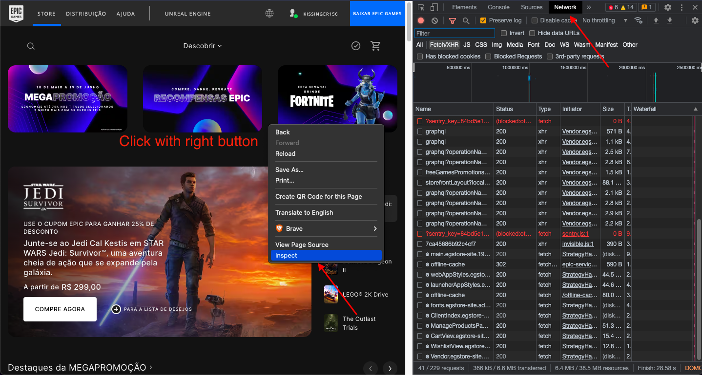
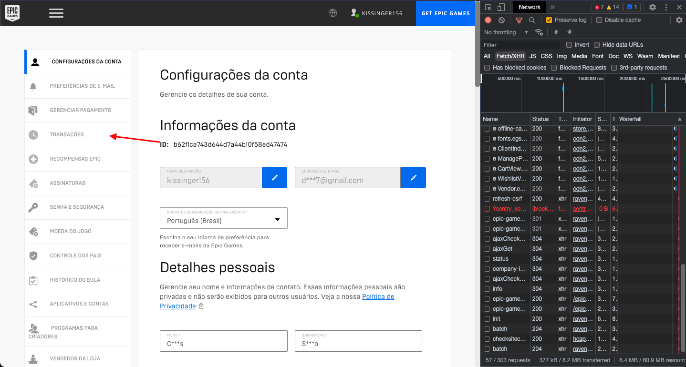
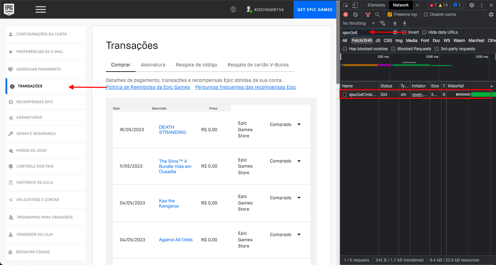
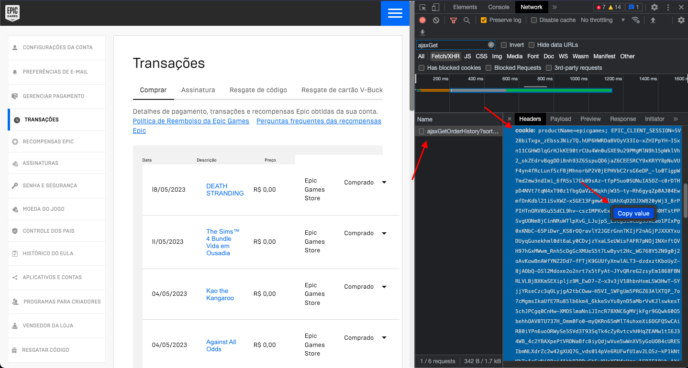

# Script to Generate a CSV File with all games that you have in your Epic Games Account

This script can be util if you want to get the relation between all your purchased games, price and the acquired date. You can use it to get the total value of your account :D.

I made this script because I don't have the Epic Games client installed, so I didn't find a session on site to show all games that I've on the account, so I found in the **Transactions** section a way to get this information automatically.

The scripts basically will use the cookie that is used on the **Transactions** section to get the information by API.

## Setup

**Requisites**
- You need to have a Epic Games account
- You need to have the Nodejs installed

### Step by Step

**Steps on Epic Games Account**

1. Access your [Epic Games Account](https://www.epicgames.com/)
2. Open the **Browser Inspect** and access the **Network tab**

3. Access the **Transactions section** [Account > Transactions](https://www.epicgames.com/account/transactions?lang=pt-BR&productName=epicgames)

4. Now inside of **Browser Inspect** search by the term **ajaxGetOrder**, probably will has one match

5. Click on the matched item and lets search by the **cookie** information, click with **right button** and select **copy value**


_Doesn't share your cookie, because it can be dangerous and can open your account access_

**Steps on Code**

1. Now with your cookie value in hands let's setup our project
2. Duplicate the **.env.default** file and rename it to **.env**
3. Put the cookie value after the COOKIE=**here** in your **.env** file
4. Now let's install the project libraries running `npm install`
5. Now let's run the script running `npm run start`

**Now just wait to finalize the script :D**

### Checking the results

If everything working well, a new file will be created at `src/assets` called **games-info.csv**, the file content will follow the structure:

```csv
Name;Price;Date
Game1;R$ 29,99;02/03/2020
Game2;R$ 39,99;03/03/2020
...
```

Now you can get this file and use it to know how much your account cost, or just the quantity of the games that you have :D.